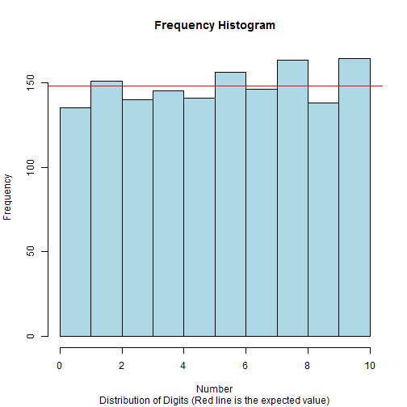

## Why?
### Random numbers have many uses.

1. Making games unpredictable
2. Unbiased sampling
3. Simulation e.g. Monte Carlo
4. Cryptography

---

## Generating Pseudo-Random Numbers
### MidSquare Method
$X_0 = 4567$    (The seed I chose)

$X_0^2 = 20\color{blue}{8574}89$  (The seed squared)

$X_1 = 8574$ (The first pseudo-random number)

$X_1^2 = 73\color{blue}{5134}76$

$X_2 = 5134$ (The second pseudo-random number)

$X_2^2 = 26\color{blue}{3579}56$

$X_3 = 3579$ (The third pseudo-random number)

---
## My Method of Generating Pseudo-Random Numbers

<table><td>
  <table>
  Create a dictionary mapping letters to numbers and a counter that increments by one after each letter. The final algorithm is: $Num = (Map[letter] + counter) % 10$  
  Map = {a=0, b=1, c=2, d=3, e=4, f=5, g=6, h=7, i=8, j=9, k=0, l=1, m=2, n=3, o=4, p=5, q=6, r=7, s=8, t=9, u=0, v=1, w=2, x=3, y=4, z=5} 
    example: Map[n]=3, Map[a]=0
     This string "aaahelloworld" will produce the following random numbers:  Follow the step-by-step example on the right.
     The map is the "seed" and the algorithm will produce the same sequence of numbers for the same text every time.
  </table></td>
  <td><table>
  <tr><th>Num</th><th>letter</th><th>Map</th><th>counter</th></tr>
<tr><td>0</td><td>a</td><td>0</td><td>0</td></tr>
<tr><td>1</td><td>a</td><td>0</td><td>1</td></tr>
<tr><td>2</td><td>a</td><td>0</td><td>2</td></tr>
<tr><td>0</td><td>h</td><td>7</td><td>3</td></tr>
<tr><td>8</td><td>e</td><td>4</td><td>4</td></tr>
<tr><td>6</td><td>l</td><td>1</td><td>5</td></tr>
<tr><td>7</td><td>l</td><td>1</td><td>6</td></tr>
<tr><td>1</td><td>o</td><td>4</td><td>7</td></tr>
<tr><td>0</td><td>w</td><td>2</td><td>8</td></tr>
<tr><td>3</td><td>o</td><td>4</td><td>9</td></tr>
<tr><td>7</td><td>r</td><td>7</td><td>10</td></tr>
<tr><td>2</td><td>l</td><td>1</td><td>11</td></tr>
<tr><td>5</td><td>d</td><td>3</td><td>12</td></tr>
</table></td></table>

--- &twocol
## Histogram

*** =left
### R's Random Numbers
 

*** =right
### My Random Numbers
 
